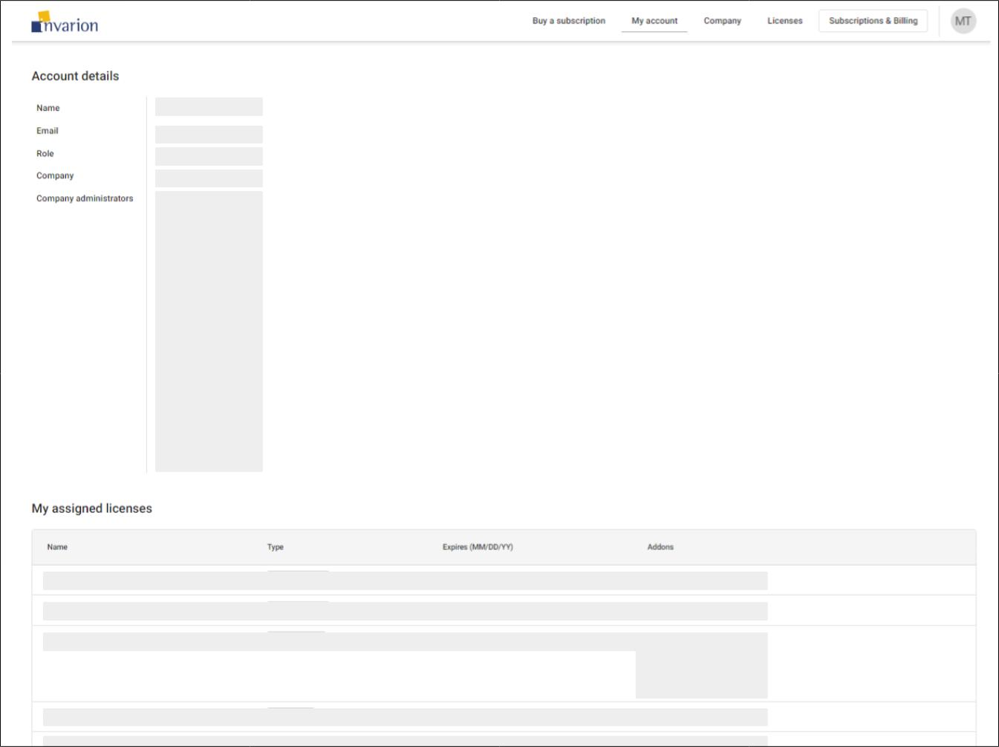

---

sidebar_position: 3

---
# Managing Company Accounts
  
Once you have logged in to your account, you will be taken to the My Account page.

 This page shows your account details including:  
  
- Your email address or username
- Your role within the system, whether you are a Company admin or standard user
- Your company name
- And a list of your account Administrators.

## Access types

If you have standard access, you can view the licenses and add-ons linked to your profile.

If you have Administrator access, you will be able to view, edit and manage all of the employees and licenses your company owns. You will also have the ability to purchase additional products for your company account.

## Managing users

Navigate to the Company page.

If you have Administrator access, you will see a list of all current user profiles on your account under the company section, here.

To grant Admin access to an employee, click the action button and select "Give admin access". Conversely, to remove admin access for an employee, click the action button and select "Remove admin access" (click revert on a member)

If you have Admin access, you can remove any user from the Company by clicking on the context menu here and selecting remove user. This will also remove them from any license they are currently assigned to.

## Editing company information

Under "Company information" you can edit your company name and add a contact person. We recommend completing this information so we can contact the appropriate person if you ever need assistance with your subscriptions. (fill in company info with details)

## Adding new users

To add new employees to your account, simply share this "Company invite" link with the people you wish to add. This link will enable them to register a user profile that is automatically linked to your company account. Once the new employee has created an Invarion profile, they will appear in the Company members list and can be assigned licenses and add-ons.
