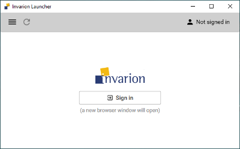
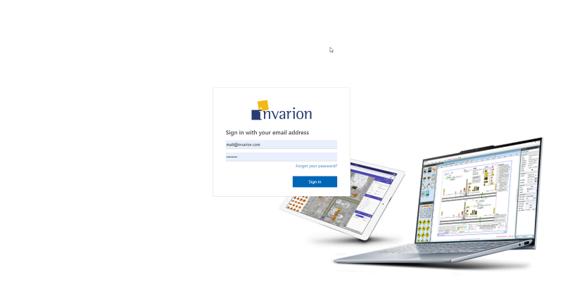
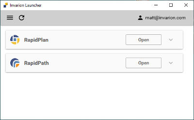
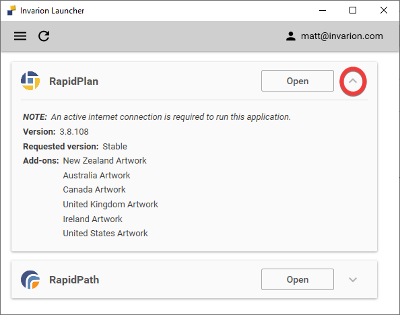
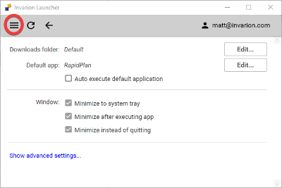

# Install and use the Invarion Launcher

The Invarion Launcher installs, updates, and opens Invarion **desktop applications** such as RapidPlan and RapidPath.

## Install the Launcher

Download the Launcher installer:

[Download Invarion Launcher](https://invarion.com/downloads/InvarionLauncherSetup.exe)

The Launcher usually does not require administrator access. Install it separately for each Windows user who will run Invarion **desktop applications**.

Contact [Invarion Technical Support](https://invarion.com/support/) if your organization needs an MSI-based deployment or has custom installation requirements.

## Sign in

Open the Launcher and select **Sign In**.

The Launcher opens a browser window where you can sign in with your Invarion account.

After sign-in is complete, close the browser window and return to the Launcher.

If you have forgotten your password, use the **Forgot your password** link on the sign-in page.

## Open an application

After you sign in, the Launcher shows the Invarion **desktop applications** assigned to your account, such as RapidPlan and RapidPath. The applications you see depend on your licenses and add-ons.

Select **Open** next to the application you want to use.

If the application needs to be installed or updated, the Launcher downloads the required files automatically before opening it.

Select the refresh icon in the Launcher to check for updates or refresh the list of available applications.

If an application is missing, ask your account administrator to check that the correct license or add-on is assigned to your user. See [Manage licenses and add-ons](../account-management/manage-licenses-and-add-ons).

## Check version and add-on details

Open the application details to see the installed version and assigned add-ons.

add-ons are assigned from your Invarion account. See [Manage licenses and add-ons](../account-management/manage-licenses-and-add-ons).

## Launcher settings

Open the Launcher menu to access **Settings**.

In Settings, you can change the default folder used for downloaded application files.

The Launcher also includes advanced settings. The Launcher warning for those settings is:

> The settings below are used for advanced debugging and troubleshooting. To avoid getting locked out, please consult Invarion **Technical Support** before editing them.

If you have a technical issue with the Launcher or an Invarion desktop application, see [Troubleshoot Launcher issues](./troubleshoot-launcher-issues).
