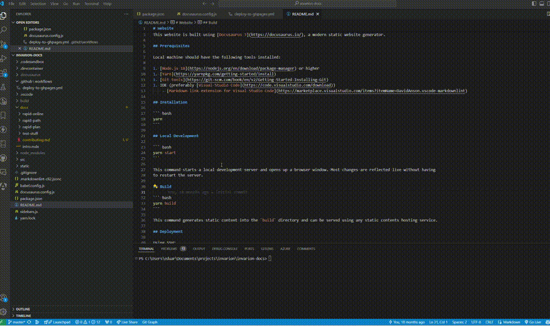
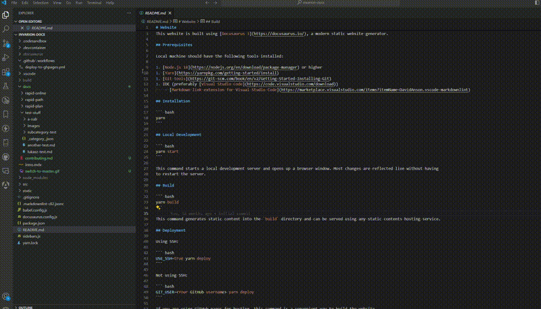
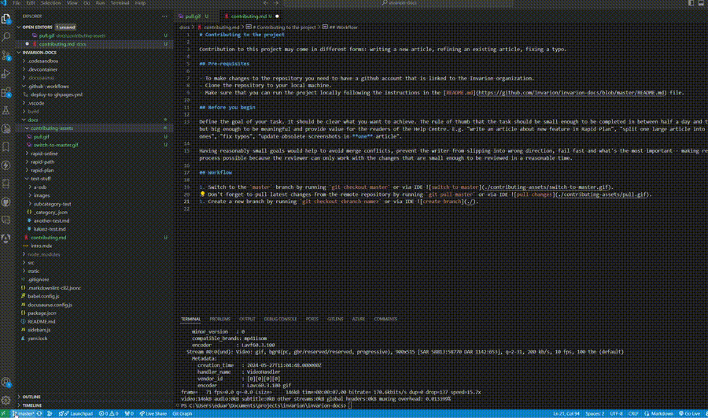

# Contributing to the project

Contribution to this project may come in different forms: writing a new article, refining an existing article, fixing a typo.

## Pre-requisites

- To make changes to the repository you need to have a github account that is linked to the Invarion organization.
- Clone the repository to your local machine.
- Make sure that you can run the project locally following the instructions in the [README.md](https://github.com/Invarion/invarion-docs/blob/master/README.md) file.

## Before you begin

Define the goal of your task. It should be clear what you want to achieve. The rule of thumb that the task should be small enough to be completed in between half a day and two days but big enough to be meaningful and provide value for the readers of the Help Centre. E.g. "write an article about new feature in RapidPlan", "split one large article into smaller ones", "fix typos", "update obsolete screenshots in **one** article".

Having reasonably small goals would help to avoid merge conflicts, prevent the writer from slipping into wrong direction, fail fast and what's the most important - making review process possible because the reviewer can only work with the changes that are small enough to be reviewed in a reasonable time.

## Workflow

- Switch to the `master` branch by running `git checkout master` or via IDE .
- Don't forget to pull latest changes from the remote repository by running `git pull master` or via IDE .
- Create a new branch by running `git checkout <branch-name>` or via IDE 
  - branch name should be descriptive and reflect the goal of the task, written in kebab-case, e.g. `update-obsolete-screenshots-in-rapidplan-article`, `explore-vehicle-library`.
- Start adjusting the content
- Once some progress is done that is worth fixation, commit the changes using commit button in the **Source Control** tab with message describing what was done. Remember that the task may (and often should) consist of multiple commits.
- Once the task is completed, push the changes to the remote repository by pressing on Push button.
- Go to the [github repository page](https://github.com/Invarion/invarion-docs/pulls) and create a new pull request by pressing on the **New pull request** button and selecting your branch in the compare list.

Example video of [the workflow](https://drive.google.com/file/d/1ecj_jVhb0tjvQ6zyMr5YCVN6Zrvwrtjw/view?usp=drive_link).

## Project structure

- Follow standard recommendations from [docusaurus documentation](https://docusaurus.io/docs/next/create-doc).
- Name files and folders in kebab-case, e.g. `new-feature-in-rapidplan.md`, `vehicle-library`. No numbering is needed.
  - File names are usually in lowercase.
  - Words are separated by hyphens (-).
  - The file extension should be .md for Markdown files.
  - The document's id is determined by the file name. For example, if your file is named my-doc.md, the id of the document will be my-doc.

## Metadata and sidebar configuration

Each article and section may have metadata. Metadata is configured differently for articles and sections.

### Metadata for articles

Metadata for articles is defined at the beginning of the file in the following format:

```markdown
---
sidebar_position: 2
title: My Custom Title
tags: ['tag1', 'tag2', 'tag3']
---
```

Tags are used for SEO purposes, sidebar_position is used to define the order of the article in the sidebar.

### Metadata for sections

Each folder in the `docs` directory represents a section in the sidebar. The section metadata is defined in the `_category_.json` file in the following format:

```json
{
  "label": "RapidPlan Online",
  "position": 1
}
```

Name of folder is used as a label, however, it can be overridden by the label property. Position is used to define the order of the section in the sidebar.

## Style guide

The project uses Markdown lint to enforce a consistent style across the documentation. The rules are defined in the `.markdownlint-cli2.jsonc` file.
Use markdown lint plugin that is available in your IDE to check the style of the document. Fix all yellow and red warnings before creating a pull request.

### Images

**Selection Box style:**

Used to bring attention to a particular area/s of an image.

- Rounded rectangle tool.
- Red outline, transparent fill.
- Stroke width: 4.5.
- Corner radius: 5.

**Arrows:**

Used to draw attention to a particular point in an object, or perhaps something smaller in an image.

Use smaller, red arrows.

**Text:** Black (unless it can't be seen easily, then red), no text boxes/background, Arial font.
Keep text size very readable, but on the smaller side. Only increasing its size if required for the text to be noticeable in the scene.

### Headings

Try to keep headings succinct and in simple language. Often it is best for the heading to simply be the thing the section will be explaining.

There are three main tiers of heading:

'#' is the largest, only used at the start of a file.
'##' are mid and related to the primary topics of the file, falling within the purview of the file's primary heading/title.
'###' for headings subordinate to '##' headings.

Generally this shouldn't happen and ought to be avoided, but if there is a case for a fourth tier of heading, these can be represented using **bold** lettering.

**Capitalisation in headings**

'#' and '##' tier headings have all words capitalised that aren't little conjunction/definite article words (like 'as', 'and, 'in', 'a', 'the' etc.), unless the little word is at the start of the sentence.

'###' and (if necessary) 'four tier **bold**' headings are made up of words in lower case, unless they start the sentence or are the name of a product/feature ('Scratchpad' etc.).

### Referring to buttons

|The button         |                                                                 How to refer to it (including the use of bold)    |
|----------------|----------------------------------------------------------------------|
|**Control**| **Ctrl** |
|**Escape**|**Esc**|
|**Spacebar**| **Spacebar**|
|**Left, Double and Right click|**Left click**, **Double click** & **Right click**|
|Any other key | Predictably: **[that key]** (eg. '**Alt**', '**X**', '**Shift**', '**2**', '**Enter**', etc.)|
|Click paths | Bold, 'more than' symbols ('>') between each step, a space between words and the '>'.<br /> Capitalise as if a top tier heading (see above).<br />Single quotation marks used if something needs to be clicked that isn't a standard sounding button/step in the path: <br />Eg: '**Tools > Preferences > go to 'Export/Import Settings' > Export**'.|
|Key combinations| When keys are pressed at the same time.<br />In bold, plus (+) symbol between each button, spaces around the plus symbol.<br />Eg. '**Ctrl + Z**'.|

### Other uses of Bold

Drawing attention to a topic/feature that is key to that or a coming section.

### Italics

Used sparingly, as you would normally use italics:

- Drawing attention to something that doesn't fit the description of Bold use cases.
- To add emphasis.

### Capitalisation in body

### Markdown Lint rules not currently observed/obeyed

(As seen when VS Code add-on 'markdownlint' is enabled)

- MD036/'no emphasis as heading': Not observed currently as a fourth tier of heading proves useful and it hasn't broken anything.
- MD024/'no duplicate headings': I believe this rule is only broken in the Release Notes sections, as headings like 'More changes' connotate the beginning of more minor changes for that release period.
