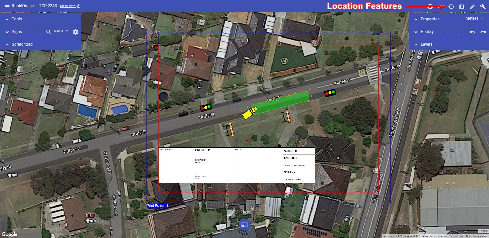
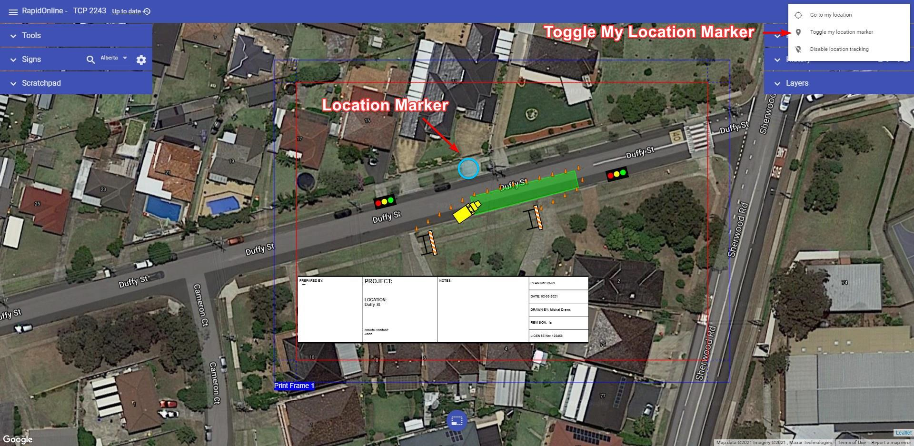

# Location-based Features

RapidPlan Online has two basic location features:

- **Go to my location** - Moves map to your current location.
  
- **Toggle my location marker** - Shows/hides marker of your current location.

They may come useful when creating the plan or making amends to the plan while being on site. You can find them in the top-bar, under the "location" icon.

To disable location tracking in RapidPlan Online click on the "Location" button and choose "Disable location tracking".

**Note**: For the ''Go to my location'' and ''Toggle my location marker'' functions to operate, location services must be enabled on your device.