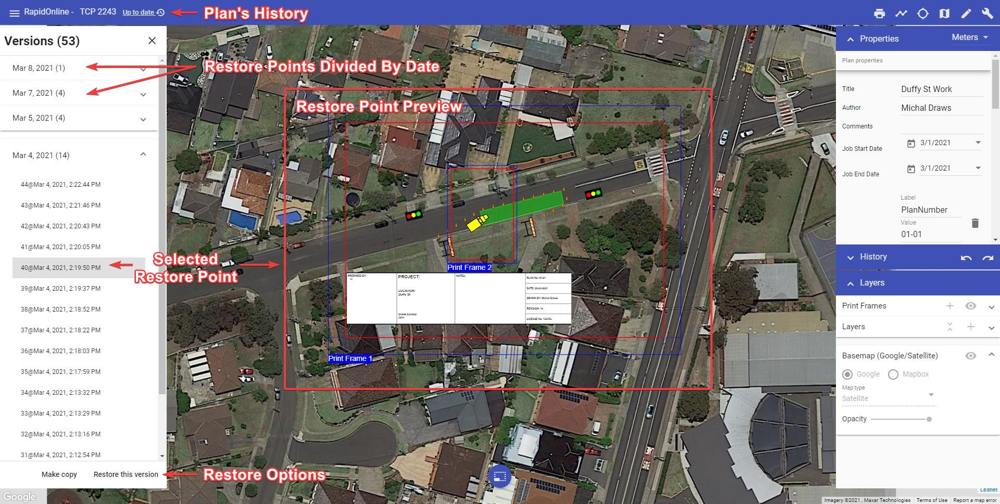

# Restoring Previous Version of the Plan

Anytime the plan autosaves a new recovery point is made. Thanks to this you can easily go back to any previous version of the plan undoing some unwanted changes made by yourself or other collaborators. It is like turning back the clock.

To recover a previous version of the plan click on the plan's "Save Status" on the top bar. A new dialogue will appear listing all the possible recovery points for this plan. They are divided by date and each has a unique number and timestamp. When switching between different revisions you can see your plan changing. This is live preview This will help find a right moment in the history.When you select a revision it will show up on your canvas as a preview. You can then visually decide if that is the version you want to restore. Once you selected the version you are interested in, choose one of two options at the bottom of the dialogue, "Restore this version" or "Create copy". The former restores the original plan to the selected previous version. The latter creates a new plan from information saved in the selected recovery point.

**Notes:**

- If you restore a previous version of the plan, you will still have access to the later versions of the document. So, no risk is involved.
- You can also [restore the previous version of the plan from the Invarion Cloud level](/docs/rapid-online/3.%20The%20Invarion%20Cloud/3.9%20Plan_s%20History.md).