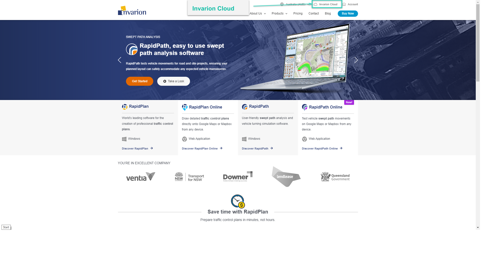

# Getting Started

To start using RapidPlan Online, first log into your Invarion Cloud account. You can find the Invarion Cloud [here](https://cloud.invarion.com/home), or it can be found by clicking the Invarion Cloud button on our home screen at [invarion.com](https://invarion.com) in the top right of the page.

