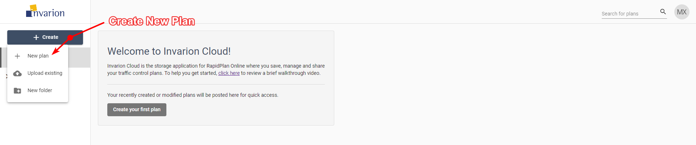

# Creating your first plan

To create your first plan, from the Invarion Cloud click the **Create** button and choose **New plan** from the menu. After clicking this you will be taken to **RapidPlan Online**.

Later, you can find your plan in the **Plans** sections inside **Invarion Cloud**.
More details on using the Invarion Cloud can be found in the [Invarion Cloud](/docs/rapid-online/3.%20The%20Invarion%20Cloud/) section.