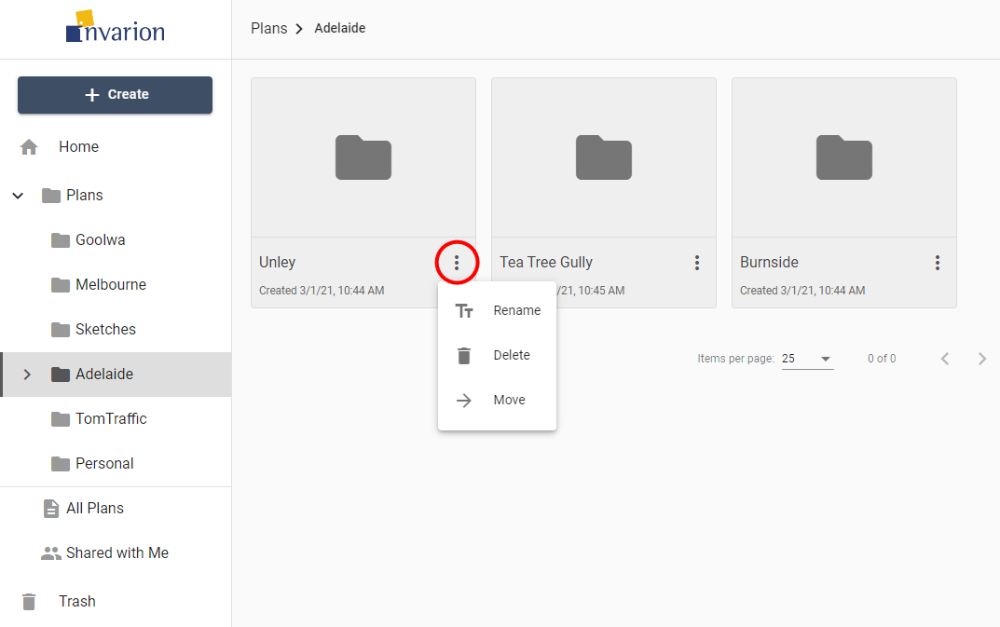

# Folders Actions

You can see available actions for the folder by clicking on the "three dots" button near its name. This will open folder's context menu with all options listed.

Different actions you can do on folders:

|Action|Description|
|---|---|
|**Rename**|Change name of the folder.|
|**Delete**|Move folder and its contents to trash.|
|**Move**|Move folder and its contents to a different location.|
