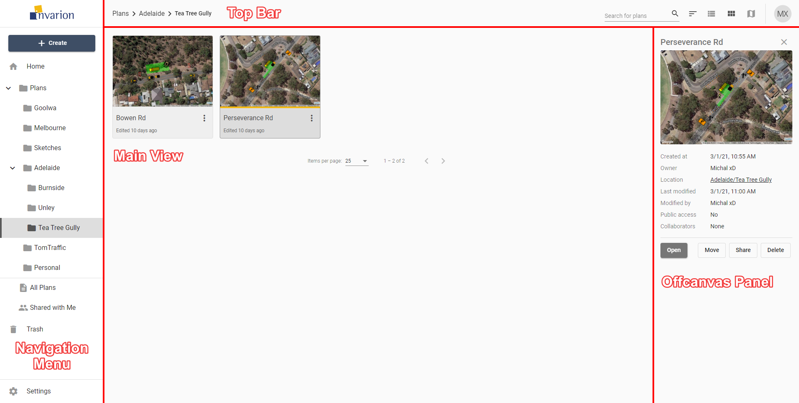

---

sidebar_position: 2

---
# Layout
## Overview
Invarion Cloud is a dynamic web-application that consists of for main elements:

|Element|Description|
|-----------|-----------|
| **Navigation Menu**      | Navigation menu located on the left side of the screen is used to navigate through different sections of the Invarion Cloud such as "Plans", "Trash", "Shared with Me". Navigation menu also holds "+ Create" button for creating new plans, folders or uploading existing plan from your computer. |
| **Top Bar**   | At the top of the page, on the left side you can find an interactive path to your current location. Right part of the top bar is populated by a search input for searching folders and plans, toggle buttons for switching the type of view and your initials button that holds a link to account settings, support page and logout option.       |
| **Main View**   | Main view of the page showing selected folder or section. |
| **Off-canvas Panel** |  Panel on the right side of the screen used for displaying details of selected plan or folder. |

**Note:** Even though Invarion Cloud is a single page application, it stores your current folder location in your web browser search bar. Thanks to that, you can successfully create browser bookmarks for your favourite or commonly used sections.

