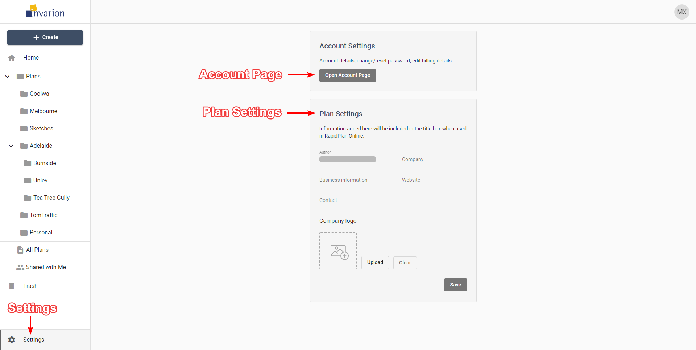

---

sidebar_position: 18

---
# Settings

To enter settings use the "Settings" button at the bottom of the navigation menu. From here you can visit your account page to change your password or edit your billing details. You can also change your default plan settings such as author and company name, your website or upload a company logo. This information will be used to populate the title block when used in RapidPlan Online.

## Logging Out and Contact

To Log out of the Invarion Cloud click on the "your initials" button in the top-right corner of the screen and choose "Logout".

If you have any questions about Invarion Cloud, or you would like to see a particular feature added, please feel free to contact us. To open contact page click on the "your initials" button in the top-right corner of the screen and choose "Support".
