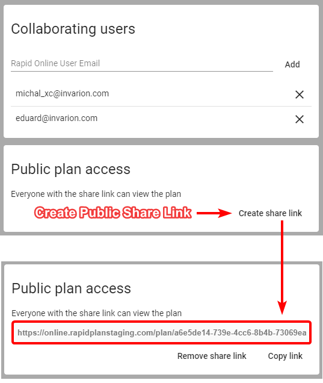

---

sidebar_position: 16

---
# Sharing via Public Link with Anyone

You can share your plan with anyone (including people who don't have RapidPlan Online subscription) via a unique link. A Person who has the link can view the document but cannot edit it. This applies to both RapidPlan Online subscribers and non users. If you want to share a plan with the editing privilege use the method mentioned in the previous point ([Sharing with Other RapidPlan Online Subscribers](./Sharing%20with%20Other%20RapidPlan%20Online%20Subscribers.md)).

To create a sharable link click on the "Share" option in the plan's context menu or on the plan's details panel. A new dialogue will appear. In the bottom section of the dialogue click the "Create share link" button. You can then copy the link and share it with anyone you want. From now on this plan will be marked as "public". You can stop sharing at any time using "Remove share link" option in the same dialogue.

