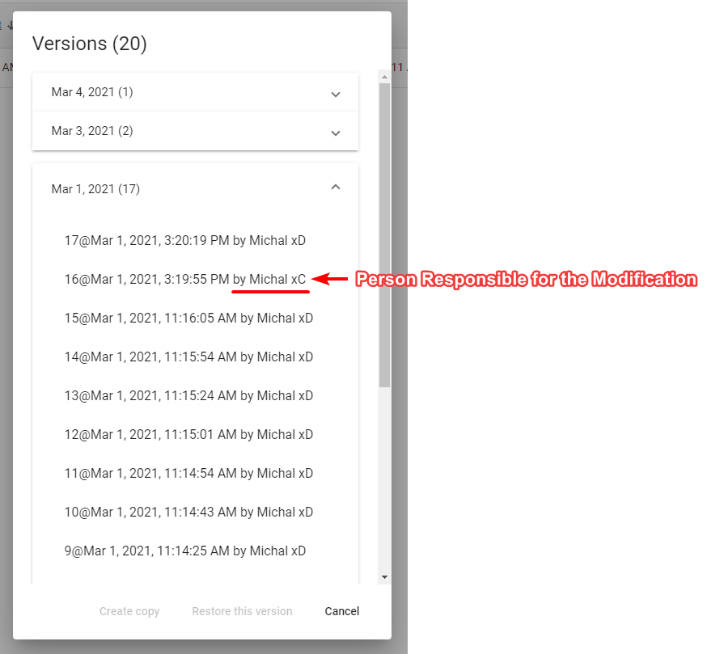

---

sidebar_position: 15

---
# Sharing with Other RapidPlan Online Subscribers

Sharing plan with other RapidPlan Online subscribers will allow for a collaboration in creating the plan. To add collaborators to your plan click on the "Share" option in the plan's context menu or on the plan's details panel. New dialog box will appear. In the top section of the dialog enter RapidPlan Online user's email and click "Add".

Invited user will be notified about this fact in email, and the shared plan will appear in his or her "Shared with Me" section. In your storage this plan will be marked as "shared" and collaborators will be listed in the plan's details. You can add multiple collaborators to a single plan. To remove the collaborator click the "X" button near the email of the user you want to delete.

List of things collaborators can do:

- edit your plan,
- rename your plan,
- duplicate your plan,
- restore the previous version of the plan.

List of things collaborators can't do:

- further share your plan with other people or users,
- move your plan to a different location,
- delete your plan.  

You can track the activity on your shared plan using the plan's details where the last modification date and person responsible for the change are listed. Collaborators are also listed in the plan's history where you can restore any previous version of the plan [Plan's History](./Plan_s%20History.md)

