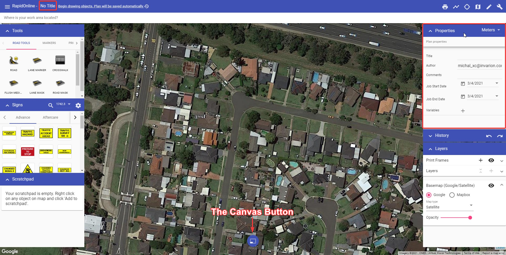

# Canvas area

The Canvas area is where your traffic plan is created. When you open a new plan, a Google Maps (satellite view) of your worksite location is displayed on the canvas background. Changing the background (Map provider and view) is discussed later in this Chapter. 

Another feature of the canvas area is the **Canvas button**, highlighted the image below.

The Canvas button allows you to simply toggle between the [Select Tool](./4.2.1%20Select%20tool.md) and [Pan/zoom](./4.2.2%20Pan%20or%20Zoom%20tool.md) tools. This button can also has a **confirm action** function, which is particularly useful for tablet users. When using most tools, a check will appear on the canvas button. Select it confirm an object creation/change on your plan and finish using the currently selected tool.

**Quick tip:** While using the Select tool, hold down the Spacebar key (if you're using a desktop), then left mouse click and drag to pan across the canvas area.

|         Canvas button selection         |      Function      |
| :-------------------------------------: | :----------------: |
|  |  **Select tool**   |
|  | **Pan/zoom tool**  |
|  | **Confirm action** |