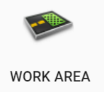
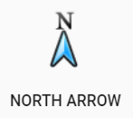
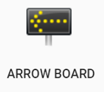
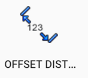

# Marker tools

|                      Label                       |                Button                 |                         Description                          |
| :----------------------------------------------: | :-----------------------------------: | :----------------------------------------------------------: |
|                  **Delineator**                  |   | Draw a delineator (e.g., cone, barrel) and change the type in Properties |
|                  **Work area**                   |   |                  Draws a work zone polygon                   |
|                 **Safety zone**                  |   |                 Draws a safety zone polygon                  |
|                  **Title box**                   |   |                   Details plan information                   |
|                 **Manifest box**                 |   |           Itemizes the number of objects on a plan           |
|                  **Legend box**                  |   |         Defines features and symbols used on a plan          |
|                 **Arrow marker**                 |   |                    Draws an arrow object                     |
|                 **Angle marker**                 |   |              Marks the angle between two points              |
|             **North arrow bearing**              |   |       Place a north bearing marker on the canvas area        |
|               **Arrow board tool**               |  |                Electronic arrow board marker                 |
|                 **Train tracks**                 |  | Draws train tracks. This can be adjusted to tram tracks on the Properties. |
|               **Distance marker**                |  |             Mark the distance between two points             |
|           **Combined distance marker**           |  |       Mark multiple distances separated into segments        |
|            **Offset distance marker**            |  |  Mark the distance between two points and offset the marker  |
| **Multi-message sign (Australian version only)** |  |             Opens the multi-message sign creator             |

