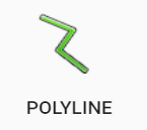
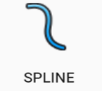
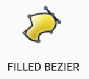
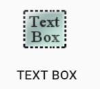

# Primitive tools

|         Label         |               Button                |                         Description                          |
| :-------------------: | :---------------------------------: | :----------------------------------------------------------: |
|     **Polyline**      |   | Draws straight lines that can be connected in a series of segments |
|      **Polygon**      |   | Draws a polygon shape that can be filled with a custom color |
|      **Spline**       |   |               Creates a curved line along path               |
|   **Filled Spline**   |   | Creates a curved line that can be connected and filled with a custom color |
|      **Bezier**       |   | Create a curved line with greater precision using control points and curve handles |
|   **Filled Bezier**   |   | Create a curved line with greater precision using control points and curve handles. Fill with custom colors |
|    **Text object**    |   | Creates an **object** out of text that can be manipulated like any other object |
|     **Text box**      |   |          Creates a box that can be filled with text          |
|     **Rectangle**     |   |     Draw rectangular shapes and fill with custom colors      |
|      **Ellipse**      |  |      Draw elliptical shapes and fill with custom colors      |
|        **Arc**        |  |              Draw a line in the shape of an arc              |
|      **Arc Pie**      |  | Creates an arc shape that can be filled with a custom color  |
| **Rounded Rectangle** |  | Creates rectangle with rounded edges that can be filled with a custom color |
|   **Insert Image**    |  | Insert an image file (jpeg, png, gif) to drop onto the canvas area |

