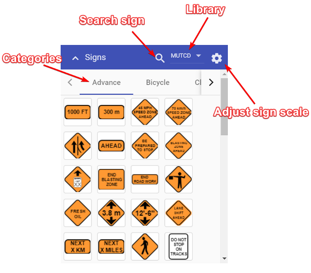

# Signs palette

The sign palette is the repository for each of the signs in RapidPlan Online. Aside from the signs themselves, the signs palette has three main components:

- **Sign library** - Drop down menu that allows you to select which signage pack you wish to use. In some cases you will only have one pack installed, but certain countries will have numerous state/region packs also installed;
- **Sign categories** - The signs are organized into tabs so that they are easy to find. Clicking through the tabs will reveal the signs for each category; and 
- **Sign search** - Search the entire sign library by keyword, phrase, sign name or sign code.

There is also an option where you can manually adjust the scale of the signs before dropping them on the canvas area. 

## Adjusting sign scale

All of the signs in the Signs palette have a default size, which is relative to the canvas area zoom level. In some instances you might need to adjust the scale of signs before placing them on the canvas area. To do this, click the gear icon on the Signs palette. This will open a scale slider. Simply move the slider to adjust the scale of the sign. 