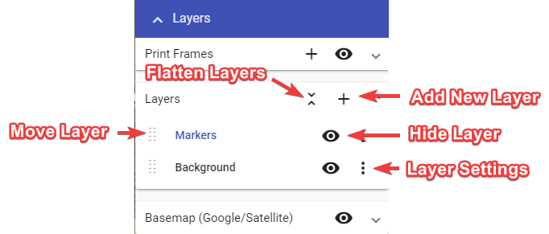
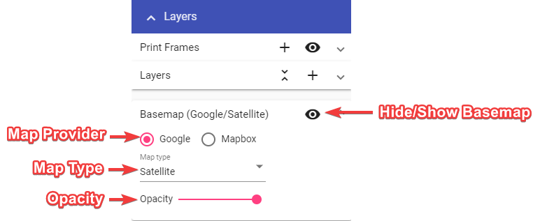

# Layers palette

There will be a lot of cases where you will need to create more than one plan for a job, such as when you have different stages of works. That's why RapidPlan Online enables you to place multiple layers on your plan.

Layers will, more importantly, help you keep things organized in your plan. You can have a separate layer for roads, signs and other plan objects. Layers will improve your workflow and allow for easier changes on a more complex plan.

By default, every plan starts with only one layer, the Background.

Layers palette is divided in two three sections:

- "Print Frames" for managing print frames,
- "Layers" for managing layers, and
- "Basemap" for basemap settings.

For more about "Print Frames" visit [Print frame tool](./4.2.3%20Print%20frame%20tool.md).

Elements in "Layers" section and their functions:

- **Add new layer** - Creates a new layer, which is then visible in the layers list.
  
- **Flatten layers** - Brings all of your current layers, and their objects, into a single layer.
  
- **Move layer** - Dragging this icon allows you to adjust the sequence of the layers in the list. This determines order in which layers are drawn on the plan.
  
- **Hide layer** - This icon toggles the visibility of the layer.
  
- **Layer settings** - The 'More Options' icon allows you to rename the layer, adjust its opacity or delete that layer.

Adjust basemap to your needs in "Basemap" section of Layers palette.

Elements in "Basemap" section and their functions:

- **Basemap Toggler** - Turn basemap on and off.
  
- **Map Provider** - Change map provider (Google, Mapbox).
  
- **Map Type** - Change between different map types (road, satellite, hybrid, etc.).
  
- **Opacity** - Change basemap opacity, you can make it a little transparent so the drawn objects stand out more.