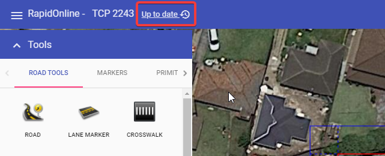

---

sidebar_position: 15

---
# Autosave feature

Changes made to a plan are saved automatically. The status bar as seen in the image below is located at the top of the page, and shows the autosave status. There are three stages which take about 4 seconds to cycle through:

- **Pending changes** -  The system is updating changes made to your plan. It is recommended you don't exit the page when changes are pending.
  
- **Saving** -  The file is saving to RapidPlan Cloud. It is recommended you don't exit the page while the plan is saving.
  
- **Up to date** - Your plan is now saved. It is now safe to exit the page.

**Note:** Panning across the map or changing plan location will not trigger the autosave function. You must draw or place an object on the canvas area to initial the autosave.

