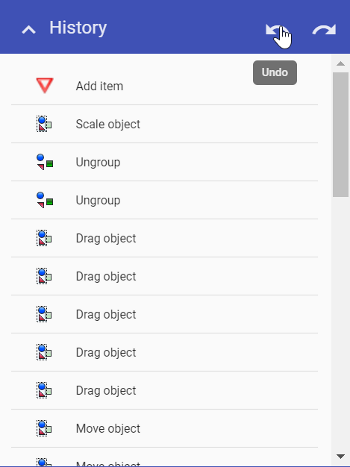

---

sidebar_position: 13

---
# History palette

The History palette contains the list of changes that you have made on the plan. On the top right of the palette, there are two arrows that represent undo and redo operations.

You can click on any of the changes made to take you back to that particular point in the plans creation.
