---

sidebar_position: 14

---
# Layers palette

While it is named the Layers Palette in light of its core and original use case, the Layers Palette has now expanded in function to include 3 sub-menus:
“Print regions” for managing print regions,
"Layers" for managing layers, and
"Basemap" for basemap settings.

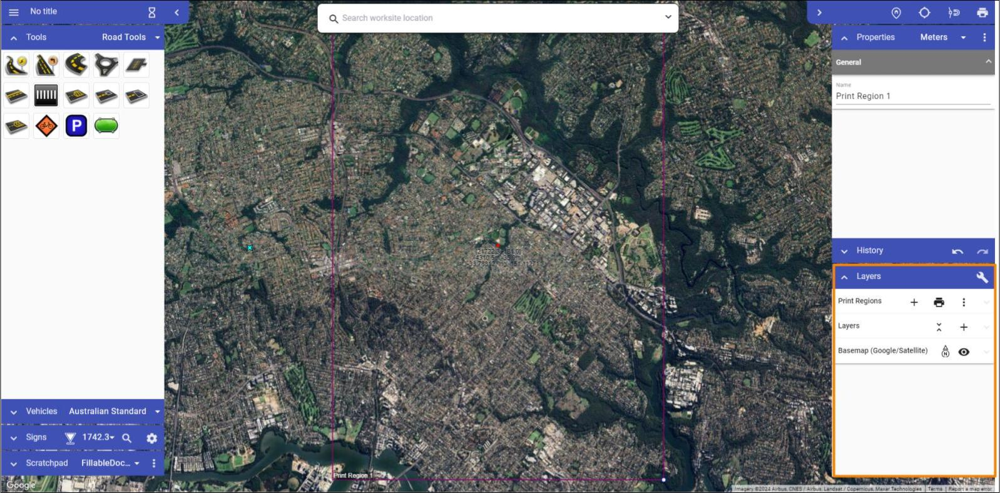

## Print Regions

Print regions are used to select an area or areas of your plan that will eventually be exported as a pdf or image. In this section of the Layers Palette we are able to create new Print Regions, as well as managing ones and export them as needed.

In the top row of buttons in the Print Regions section of the Layers Pallette:

- **Plus icon**: Create a new Print Region.
- **Printer icon**: Print *all* Print Regions.

There is also the 3 Dots Icon, which opens a drop down menu with the following buttons:

- **Fit All To Page Size**: Fit the Print Region (blue rectangle) to the Page Preview (red rectangle).
- **Turn Off Page Preview**: Shows only the Blue Print Region, removing the external red Page Preview rectangle that matches the selected page size in your [print settings](/rapid-online/9.%20Printing%20and%20Exporting/).
- **Hide Print Regions**: Hide Print Regions so that you can work on design without distraction.
- **Orientation**: Change the orientation of the Page Preview.
- **Page Size**: Change the Page size of your Page Preview.

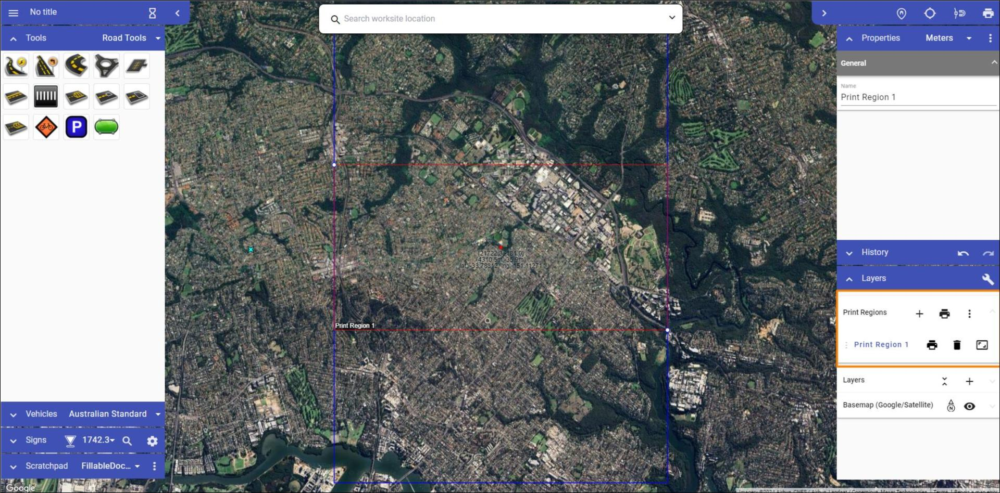

**Options related to specific Print Regions in the Print Regions section of the Layers Pallette:**

| **Function** | **Symbol** | **Details**|
| :------------------ | :----------------- |:---------------|
|Add new layer |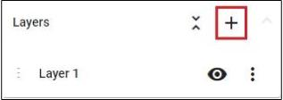 | Creates a new layer, which is then visible in the layers list. |
|Flatten layers |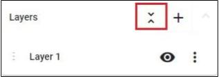 | Brings all of your current layers, and their objects, into a single layer. |
|Move layer |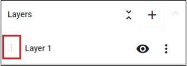 |Dragging this icon allows you to adjust the sequence of the layers in the list. This determines the order in which layers are visible on the plan.  |
|Hide layer  |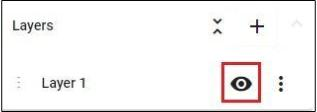 |This icon toggles the visibility of the layer.  |
|Layer settings  |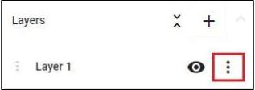 | The 'More Options' icon allows you to rename the layer, adjust its opacity or delete that layer. |

## Basemap

The Basemap sub-menu allows you to adjust the characteristics of your Basemap.

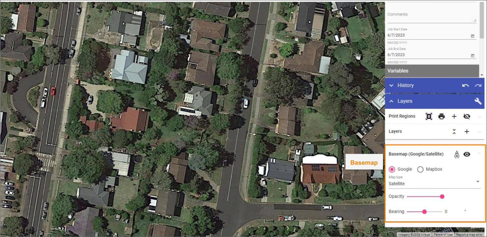

**Elements in "Basemap" section and their functions:**

| **Function** | **Symbol** | **Details**|
| :------------------ | :----------------- |:---------------|
| Bearing arrow  |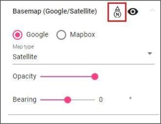  | Shows which direction is north, rotating when you change the bearing.  |
| Basemap visibility toggle  |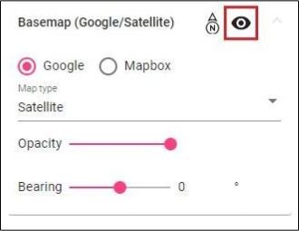  | Turn basemap on and off. |
| Map Provider  |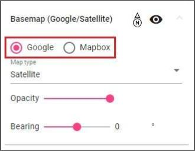  | Change map provider (Google, Mapbox). |
| Map Type  |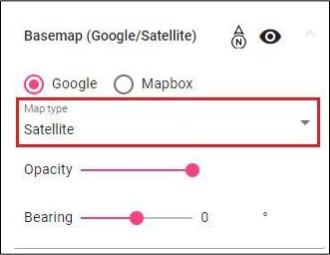  | Change between different map types (road, satellite, hybrid, etc.). |
| Opacity slide bar  |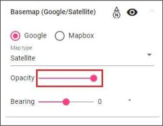  | Change basemap opacity, you can make it a little transparent so the drawn objects stand out more. |
| Bearing slide bar |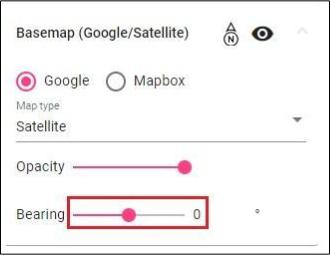  | Alters the bearing of the plan, rotating it. |

There will be a lot of cases where you will need to create more than one plan for a job, such as when you have different stages of works. That's why RapidPlan Online enables you to place multiple layers on your plan.

Layers will, more importantly, help you keep things organized in your plan. You can have a separate layer for roads, signs and other plan objects. Layers will improve your workflow and allow for easier changes on a more complex plan.

By default, every plan starts with only one layer, the Background.

Layers palette is divided in two three sections:

- "Print Frames" for managing print frames,
- "Layers" for managing layers, and
- "Basemap" for basemap settings.

For more about "Print Frames" visit [Print frame tool](./Print%20frame%20tool.md).

Elements in "Layers" section and their functions:

- **Add new layer** - Creates a new layer, which is then visible in the layers list.
  
- **Flatten layers** - Brings all of your current layers, and their objects, into a single layer.
  
- **Move layer** - Dragging this icon allows you to adjust the sequence of the layers in the list. This determines order in which layers are drawn on the plan.
  
- **Hide layer** - This icon toggles the visibility of the layer.
  
- **Layer settings** - The 'More Options' icon allows you to rename the layer, adjust its opacity or delete that layer.

Adjust basemap to your needs in "Basemap" section of Layers palette.

Elements in "Basemap" section and their functions:

- **Basemap Toggler** - Turn basemap on and off.
  
- **Map Provider** - Change map provider (Google, Mapbox).
  
- **Map Type** - Change between different map types (road, satellite, hybrid, etc.).
  
- **Opacity** - Change basemap opacity, you can make it a little transparent so the drawn objects stand out more.
