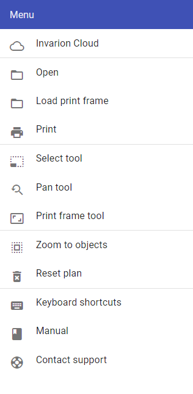

---

sidebar_position: 3

---
# Main Menu 

The Main menu contains a number of options to assist plan creation. The image below shows the main tools of the RapidPlan Online menu.

**Table 4.1** describes the function of each option in the Main menu.

| **Menu Selections** | **Description**                                              |
| :------------------ | :----------------------------------------------------------- |
| RapidPlan Cloud     | Navigates to RapidPlan Cloud.                                |
| Go to Cloud Project | Navigates to the Projects page that the current plan is stored in. |
| Go to Cloud Plan    | Navigates to the Plan page.                     |
| Print               | This option opens the Print dialogue box. Refer to [9.1 Printing] for more on printing and exporting plans. |
| Select tool         | This option enables the [Select tool](./Select%20tool.md), allowing you to select objects on the canvas area. |
| Pan/zoom tool       | This option enables the [Pan/zoom tool](./Pan%20or%20Zoom%20tool.md) which allows you to zoom or pan the canvas area. |
| Print frame tool    | This option enables the [Print frame tool](./Print%20frame%20tool.md), to then be placed on the canvas area. |
| Zoom to objects     | Selecting this option will return your view to where the objects are situated on your plan. This feature is especially helpful if you lose your bearings on the unrestricted canvas and wish to return to the plan's point of origin. |
| Restore plan        | RapidPlan contains an auto-save feature. Selecting Restore plan opens a dialog which allows you to restore a plan back to any save point (auto or manual). |
| Reset plan          | This option erases all objects, signs, layers, plan location and history within a plan. Plans accidently reset can be restored by selecting Restore plan. |
| Keyboard shortcuts  | Opens a dialogue box that lists the RapidPlan Online keyboard shortcuts. |
| Manual              | Links directly to this RapidPlan Online User Manual          |
| Leave feedback      | Opens a dialogue box where feedback can be sent to the Invarion team. |
