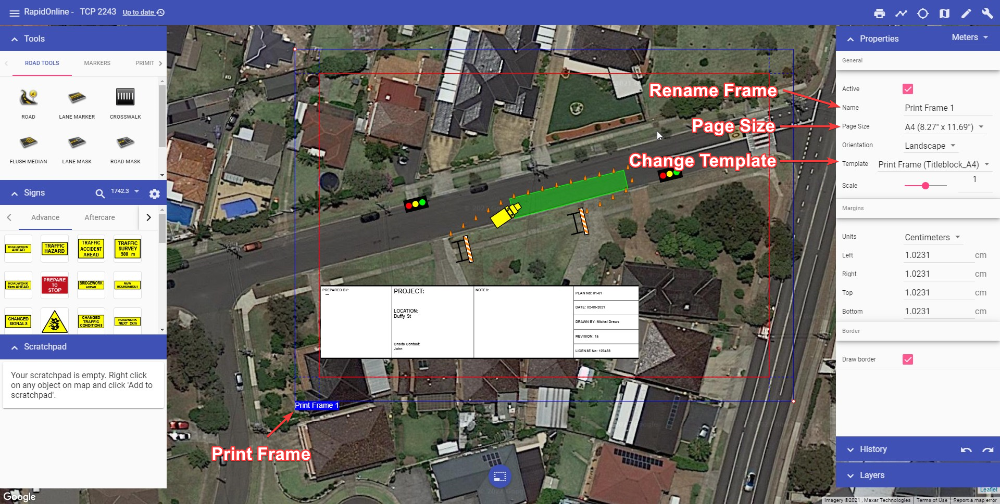
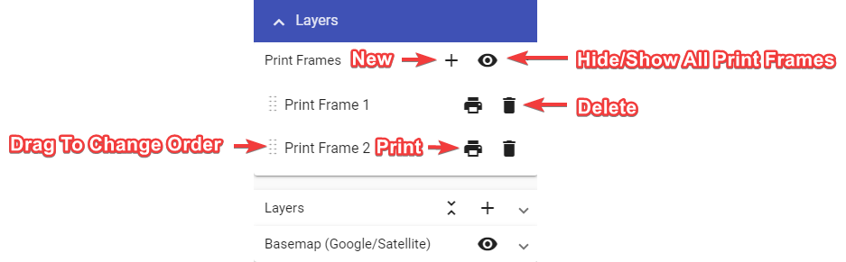
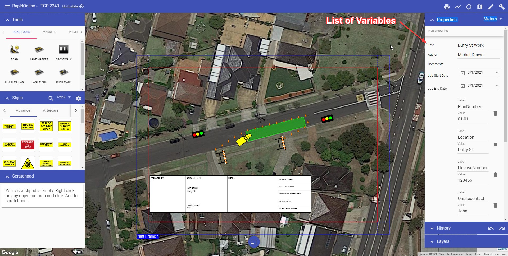

---

sidebar_position: 6

---
# Print frame tool

Print frame allows to define the exact area that will be printed. Multiple print frames can be used for multi-page print.

To add a Print frame to your plan, select the tool from the main menu and drop the frame onto the canvas area. The size of the Print frame can then be adjusted by selecting the frame on your canvas area, then clicking and dragging out it's control point in the bottom right corner.

Settings for paper size and page orientation for Print frame can be found in the Properties palette.

You can manage print frames added to the plan using "Print Frames" section in the "Layers" palette.
Use "Print Frames" section to:

- hide/show all print frames,
- add new print frame,
- change print frames order (this will affect multi-page print),
- delete print frame, and
- quickly print chosen print frame.

Pre-loaded templates (which include generic plan titleblocks) can be added to a print frame via the Properties palette.

There's currently two templates to choose from (titleblock, sideblock). When choosing a template, ensure you select the one matching your page size. The titleblock template for US letter page size is shown in the example below.

To add information to the titleblock, make sure nothing is selected on the canvas area, then scroll down to the variables section in your Plan properties (Properties palette). Enter the plan information and it will automatically populate the titleblock fields.

You can then Print or Export your plan via the Print dialogue. Printing or Exporting is covered in [Chapter 9](#printing-dialogue).

