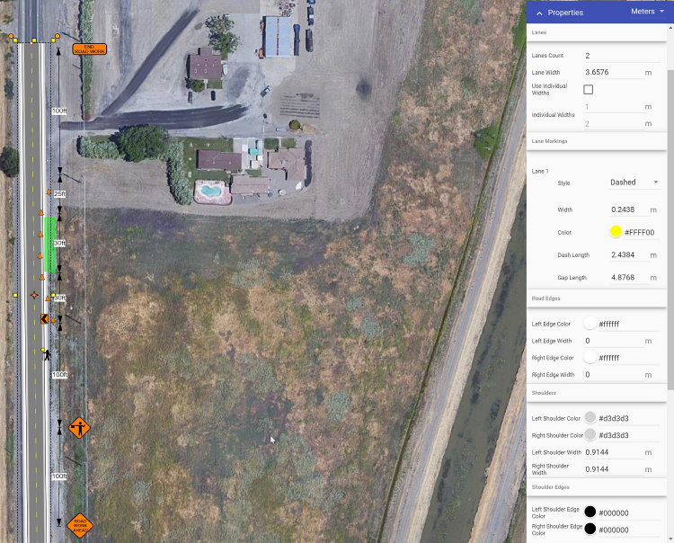

---

sidebar_position: 12

---
# Properties palette 

The Properties palette displays all the information pertaining to any selected signs, tools, markers or objects. This is where you can change fonts, colors, lane markers, etc - of a selected object.

The Properties palette allows for full customization of objects on your plan. Select the object, and you can then adjust it's properties. For example you can customize any aspect of a road.

This applies for all objects you place on your canvas area; each object has their own properties that you can edit and customize to suit your plan.

When an object is not selected, properties for the plan (e.g., title, author, work dates) are visible. These options also include resetting the plan location, defined when you first started the plan. Simply click the 'Set plan location' button and click to add the location marker on your plan. This will redefine the coordinates linked to your plan. Resetting the plan location is particularly helpful if your works are positioned at a location not defined by a physical address.
