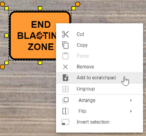

---

sidebar_position: 11

---
# Scratchpad palette

The Scratchpad is used to store signs or custom objects that you commonly use to make them easily accessible.

To add an object to your Scratchpad, just right click the object on your canvas area (or tap and hold on a mobile device), then select "Add to scratchpad" from the menu. The object will then be added to your Scratchpad.

All objects added to your scratchpad are saved to your account, making them available to use on any new plans you create. To remove an object from your scratchpad, simply right click on the item and select "Delete item".
