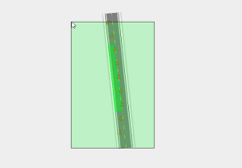

---

sidebar_position: 4

---
# Select tool

When drawing on the canvas area, your mouse can perform a number of functions. It can select objects, pan across the workspace and zoom in and out (using a mouse wheel). RapidPlan Online offers two options for alternating between these functions - canvas button, tool selection in the main menu.

The Select tool is principally used to drag and drop objects onto the canvas area. It also has a special drag-select function, used when selecting multiple objects. Clicking (tap and hold on mobile devices) and dragging your mouse creates a selection window. The direction you drag the mouse creates a different colored window.

If you drag to the right, the window is purple. This selects objects that are completely within the purple window.

If you drag to the left, the window is green. This selects all objects touching the green window.

|  | Drag right (Purple)   |  | Object selection     |
| ------------------------------------ | --------------------- | ------------------------------------ | -------------------- |
|   | **Drag left (green)** |   | **Object selection** |
