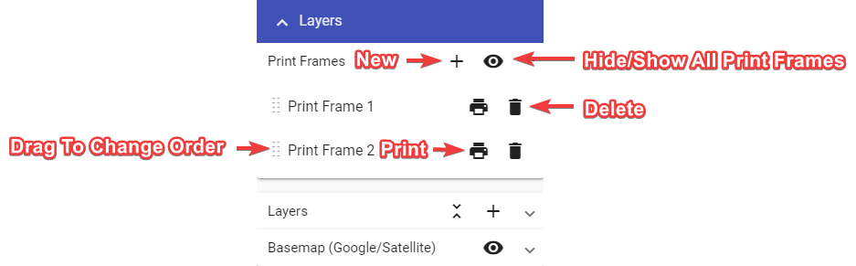
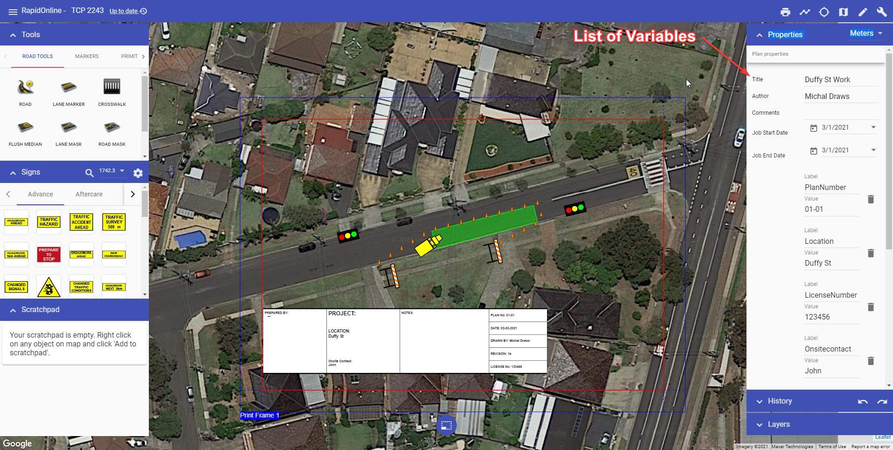

---

sidebar_position: 6

---
# Print Region Tool

Print region allows to define the exact area that will be printed. Multiple print region can be used for multi-page print.

To add a Print region to your plan, select the tool from the main menu and drop the region onto the canvas area. The size of the Print region can then be adjusted by selecting the frame on your canvas area, then clicking and dragging out it's control point in the bottom right corner.

Settings for paper size and page orientation for Print region can be found in the Properties palette.

You can manage print region added to the plan using "Print region" section in the "Layers" palette.
Use "Print region" section to:

- hide/show all print region,
- add new print region,
- change print region order (this will affect multi-page print),
- delete print region, and
- quickly print chosen print region.

Pre-loaded templates (which include generic plan titleblocks) can be added to a print region via the Properties palette.

There's currently two templates to choose from (titleblock, sideblock). When choosing a template, ensure you select the one matching your page size. The titleblock template for US letter page size is shown in the example below.

To add information to the titleblock, make sure nothing is selected on the canvas area, then scroll down to the variables section in your Plan properties (Properties palette). Enter the plan information and it will automatically populate the titleblock fields.

You can then Print or Export your plan via the Print dialogue. Printing or Exporting is covered [here](/docs/rapid-online/9.%20Printing%20and%20Exporting/#printing-dialogue).
