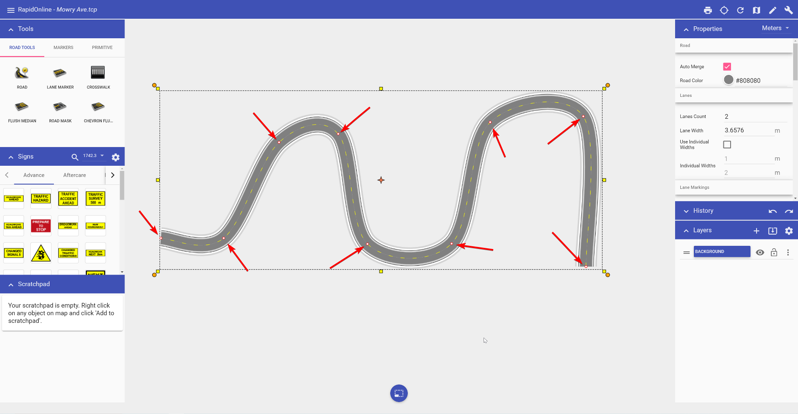
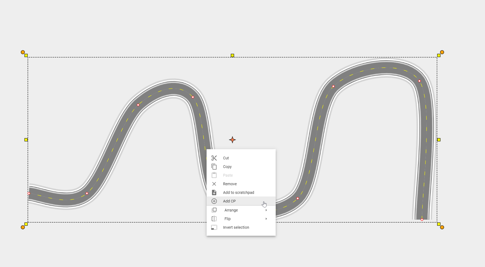

---

sidebar_position: 2

---
# Control points

Almost every element in RapidPlan Online has at least one control point. A control point (represented by a small red circle) is a handle that allows you to alter the shape of an object.  

The image below shows a road object. Each control point has been added via a mouse click, when drawing out the object. Clicking and dragging a control point will move it, adjusting the layout of the road. 

To add a control point to an existing object, simply right click on any point on the object to view the context menu. Selecting the **Add CP** option will add a control point at that point of an object.

Similarly, if you want to remove a control point, right click on the control point and select **Remove CP** from the context menu.

