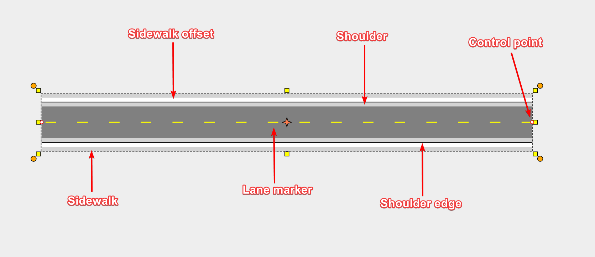

## The Road Tool

Using the road tool is very simple. As you move the mouse after you have clicked to start drawing, the roadway will "snake" behind the cursor. Each time you click the mouse on the canvas, a new control point for the road is placed. 

## Components of a road

The road contains a number of elements, as shown below. Each of these can be adjusted in the Properties palette. 

