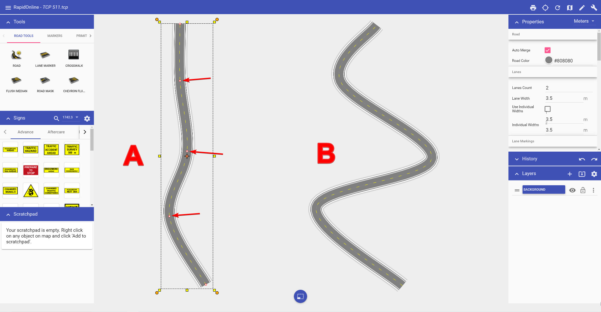

---

sidebar_position: 3

---
# Editing the road

Like any other object in RapidPlan Online, the shape of the road can be edited by shifting it's control points.

**To edit the roads shape:**

 - Select the road by clicking on it. This will make it's control points visible.
 - Drag any of the control points until you have the desired shape of the road.

In the image below, **Road A** is the original road. **Road B** has had the 1st, 2nd and 3rd control points moved to change the shape of the road.

