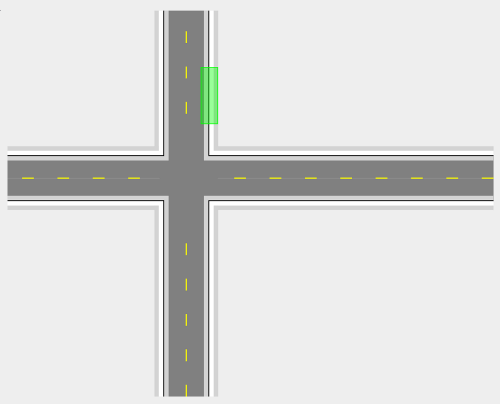

### Drawing a work zone

 - Select the appropriate tool (Work zone, Safety zone) from the Markers tab in the Tools palette;
 - Click at the first corner point of your required area and continue clicking to set corner points;
 - When the final point is placed, right click to stop drawing;
 - Right click to clear the cursor.

An example work zone is shown below. 

