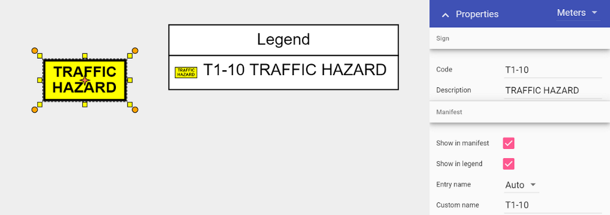

## Legend/Manifest tool

The Legend and Manifest tools are used as object references for your plan. The Legend box is a visual representation of any objects you have displayed. The Manifest box will give you a running total of objects placed on your plan.

### Adding a legend box

 - Select the **Legend** Tool from the Markers tab in the Tools palette;
 - Place this in the desired location on your plan;
 - Select an item on your plan that you want to appear in the Legend Box by clicking on it once;
 - Under the **Legend & Manifest** tab in the Properties palette make sure the **Show in Legend** section is set to **True;**
 - Do this for any other items on your plan you wish to appear in the legend.

**Note:** If you change Entry name from Auto to Custom, you can edit the sign entry name that displays in the Legend box.

### 7.4.2 Adding a manifest box

The manifest box works the same as the Legend box when adding, you can also determine what appears in the manifest by selecting an object and then adjusting its properties.

You can order your manifest by Value or Name, by toggling the selection under the Order subheading.

