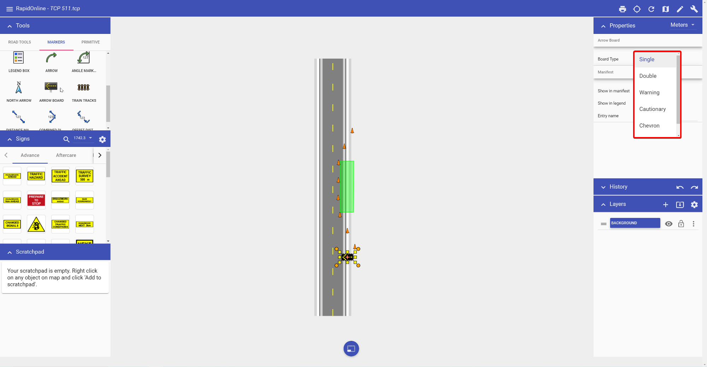

---

sidebar_position: 10

---
# Arrow board tool

They come by many names, flashing arrow boards, sequential arrow boards, arrow trailers or even illuminated trailer mounted sequential flashing arrow systems. In RapidPlan Online they are referred to as Arrow Boards. They are simple to place and use and come with various configurations for the required site setting.

There are six different Arrow Board patterns available, as shown below.

| Patterns                                   |         |                                               |            |
| ------------------------------------------ | ------- | --------------------------------------------- | ---------- |
|   | Single  |      | Double     |
|  | Warning |  | Cautionary |
|  | Chevron |    | Diamonds   |

**Placing an Arrow Board**:

 - Select the Arrow Board from the Devices tab in the Tools Palette;

 - Drop it into position on the plan;

 - Rotate it as necessary. 

   **Note:** by default the Arrow board appears as a Right flash. If you require a Left flash, use the context menu to flip the object.

