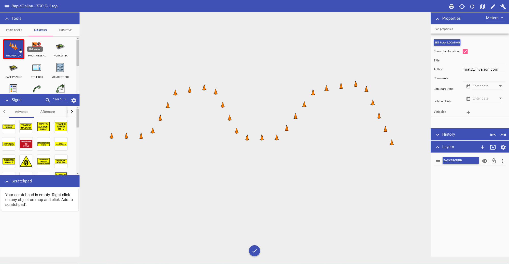

---

sidebar_position: 2

---
# Creating a basic delineator line

All delineator lines start by default as Cones. They can then be changed into the required type after placement on the plan. You can also set new values for the spacing and size of the delineator from the Properties palette.

**To create a basic delineator line:**

- Select the Delineator from the Markers tab in the Tools Palette;
- Click once where you wish to start drawing (don't hold);
- Click at each corner for your line, to drop a control point;
- After you have placed the end point, right click to stop drawing;
- Right click to clear the cursor.

