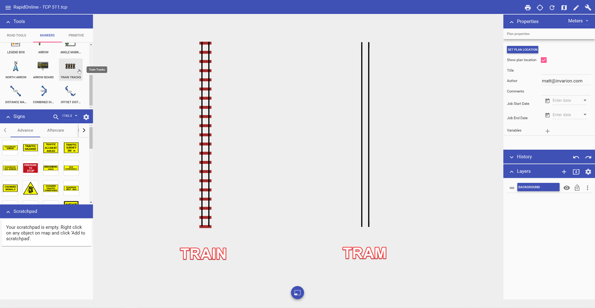

---

sidebar_position: 9

---
# Train track tool

The Train Tracks tool allows you to quickly add train or tram (light rail) lines to your plan.

**To place a train line:**

 - Select the **Train Tracks** tool from the Markers tab in the Tools Palette;
 - Click once to start your rail line;
 - Click at each turn point;
 - Right click to stop drawing.

To place a tram line, once the tool is selected, navigate to in the **Properties palette** and change the **Type** value from **Train** to **Tram**. 

Examples of train and tram tracks are show below. 

