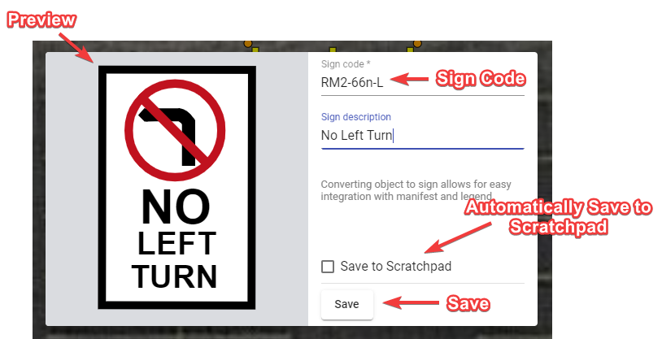

---

sidebar_position: 4

---
# Creating custom signs

You can create a custom sign from primitives and/or parts of other signs (each sign can be ungrouped into basic shapes). When you finish preparing your sing, click the right mouse button on your object/objects and choose the "Convert to sign" option from the context menu. In the dialogue that will show up fill up the sign code and the sign description fields, and press "save". Your object/objects will be converted to a sign.
This will allow for easy integration with the manifest and the legend, as your custom sign will have proper sign properties ("show in manifest", "show in legend", etc.). The sign you created will not appear in the signs library, but you can save it to the scratchpad for later use.

