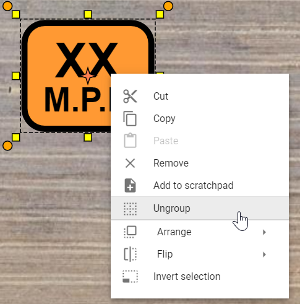
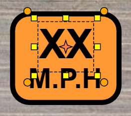
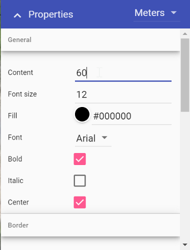
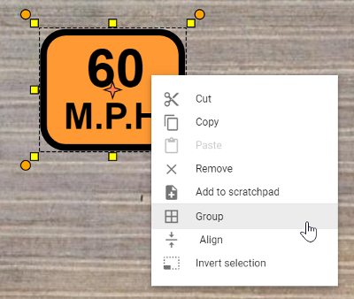

---

sidebar_position: 3

---
# Editing signs

All signs are made up of basic objects (text, shapes, etc). Not only does this make it easy to adjust the speed on a sign, for instance, it also makes each sign object completely customizable.

To edit a  sign, simply select it on your canvas area, right click, then select **Ungroup**. This will separate the sign into it's basic objects.

**Note**: Some signs with multiple objects may require more than one un-group.

Once you have ungrouped the objects, you will be able to edit, move and change the individual properties of each object within the sign.

For example, in the image above, the first text object is selected. In its properties you can then change the value to a specific amount.

To regroup the sign objects, simply select all of the objects by using a (click and drag) selection window. Then, right click and select Group, as shown below. You have now edited and created a new sign.

**Quick tip:** Add the new sign to your Scratchpad for later use, by selecting ''Add to scratchpad'' in the context menu.
