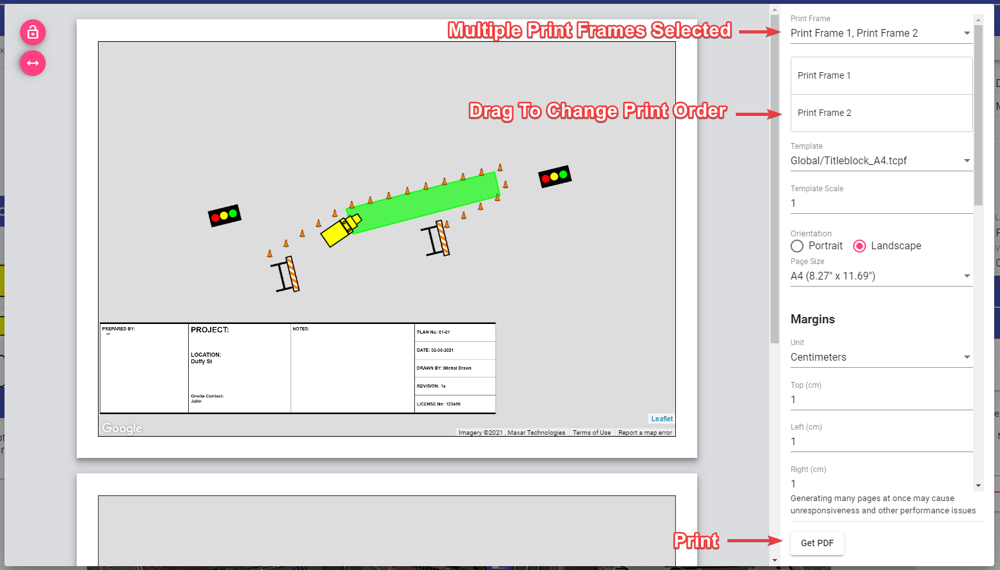

## Multi-Page Export/Print

To export or print multiple pages at once you need to create a print frame for each page. Then, select them in the print dialogue. The order of print frames depends on the sequence in which the print frames were added to the plan. It can be changed in the "Print Frames" section of the layers palette or in the print dialogue itself.

When using multi-page print, template and page options apply to all pages. Options associated with the first print frame in order will be passed to the other pages.

