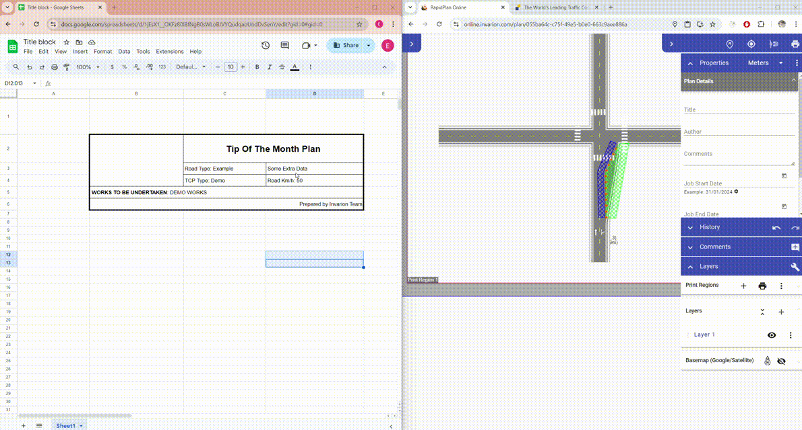

---
tags:
  - rapid online
  - rapid path online
  - tips
---

# Paste Rich Text

You can paste rich text or tables from other applications like Microsoft Work, Excel, Google docs and spreadsheet into the Rapid Online/Rapid Path Online editor. This includes text formatting such as bold, italic, and underline, as well tables.

