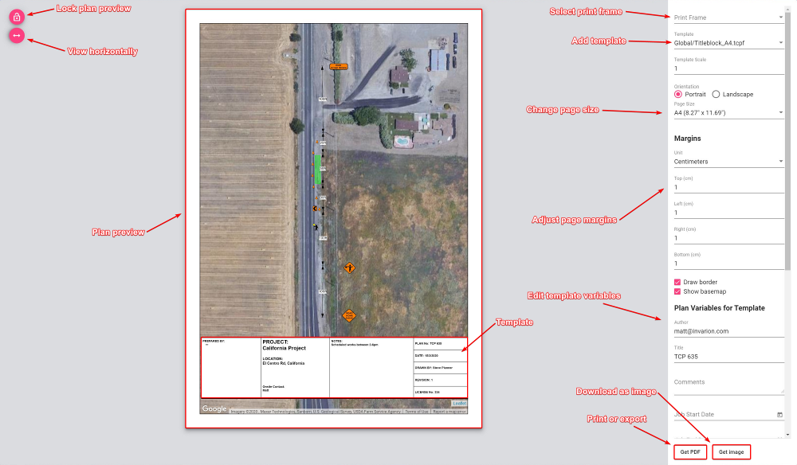
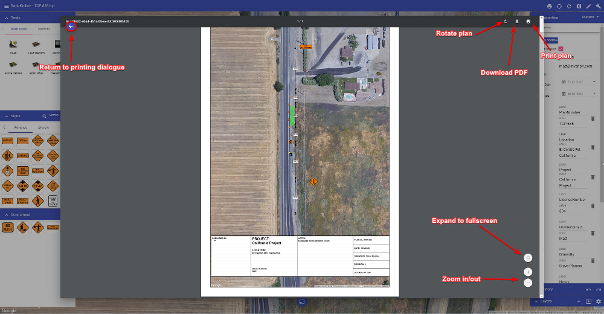

---

sidebar_position: 1

---
# Printing and Exporting

The areas you print in your plan is dictated by the location of your [Print Regions](/rapid-online/4.%20RapidPlan%20Online%20Workspace/Layers%20palette.md). When your plan is ready for Printing or Exporting, simply select the **Print** option in the Main Menu, or click the printer icon () in the toolbar. Once selected, the following print dialogue window opens, containing several options to customize your document.

These options include:

* **Plan preview:** The preview of your plan in the center shows how your plan will print out. In this preview window you can adjust the plan to fit the page size, by simply clicking and moving the map around, or by simply scrolling up and down to zoom in and out on the map area.

* **Lock plan preview:** The lock plan preview button locks the ability to adjust the plan preview.

* **View horizontally:** The view horizontally button adjusts the view of the plan for different screen sizes. For example, a laptop screen is quite often smaller - this button adjusts the view so that you can view the plan appropriately on your screen.

* **Print frame:** Select a [print frame](/docs/rapid-online/RapidPlan%20Online%20Workspace/Print%20frame%20tool.md) from this box. You can select multiple print frames for multi-page print.

* **Template:** Here you can select a template for your desired page size. Templates include generic title blocks where plan information can be added.

* **Plan variables for template:** Add and edit the information in the title block.

* **Page size and orientation:** Change the page size and orientation to suit your printout. When selected you will also need to make sure, if you have added a template, that it matches the page size/orientation you have chosen.

* **Page margins:** Adjust the page margins.

* **Print or export:** When ready to print, simply select the **Get PDF** button to download your plan as a .PDF file, or select **Get Image** to download the plan as a .PNG file.

## Exporting to PDF

Once the **Get PDF** button has been selected, you will be able to Print or Download your plan to PDF.

As shown in the image above, clicking the **Download PDF** button will allow you to save your plan as a PDF file. This will then open your default PDF application and show you a preview of your downloaded plan. Clicking **Print plan** will open your default printer dialogue.

## Multi-Page Export/Print

To export or print multiple pages at once you need to create a print frame for each page. Then, select them in the print dialogue. The order of print frames depends on the sequence in which the print frames were added to the plan. It can be changed in the "Print Frames" section of the layers palette or in the print dialogue itself.

When using multi-page print, template and page options apply to all pages. Options associated with the first print frame in order will be passed to the other pages.

