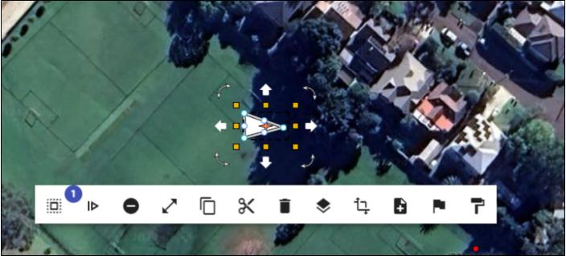

---

sidebar_position: 3

---
# Context Menu

Select an object and click the right mouse button to open a menu of additional options.

## Context menu items for single-item selections

The options will vary based on the object that is selected, but the main options from left to right are:

* **Group Selection list:** Allows you to see what items are selected, and allows you to deselect items using the 'X' button.
* **Maximise:** Show a larger version of the **Context Menu**.
* **Continue Drawing:** Place more control points, starting from where you had previously completed drawing the object.
* **Remove last CP:** Remove the last control points placed.
* **Copy:** Copy the object (it can be pasted using **Right Click** > **Paste**).
* **Cut:** Like **Copy** but removing the original object.
* **Delete:** Delete the item.
* **Arrange:** Move the item backward or forward in comparison to other objects on the same [layer](/rapid-online/rapidplan-online-workspace/layers-palette.md).
* **Transform:** Flip, rotate, or transform an object or group of objects.
* **Add to Scratchpad:** Add the object to your [Scratchpad](/rapid-online/rapidplan-online-workspace/scratchpad-palette.md).
* **Convert to Sign:** Convert the item to a sign.
* **Style:** Save the **Properties** of the object to your **Styles**, that can then be **Applied** to an object of the same type in the future - using the same **Style** button in the **Context Menu**.

## Other Context Menu items shown for multiple-item selections

* **Group:** Group the items.
* **Align:** Perfectly align the selected items, either vertically or horizontally.

**Note:** Is the Context Menu in your way? Hold the **shift** key to hide it.
