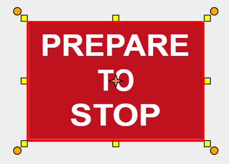
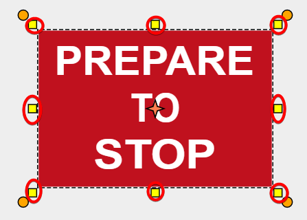
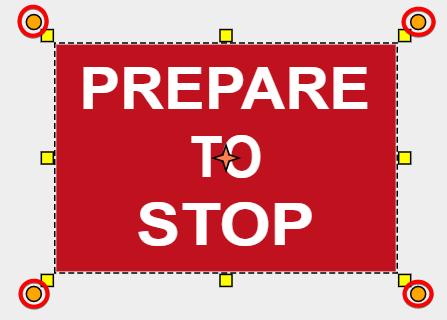

---

sidebar_position: 1

---
# Selecting Objects and Tools

RapidPlan Online uses drag-and-drop technology. To select an object or tool, just click on it with the left mouse button, or tap for mobile devices.

**Tip:** If using a tool, once finished with your last control point, right click to finish using that tool.

If you're selecting multiple objects on the canvas area, you can click on object and hold **shift
** key to preserve selected object or by pressing and holding left mouse button and then dragging mouse over objects that you want to select.

To learn more about the select tool, please visit [Chapter 4](/docs/rapid-online/RapidPlan Online Workspace/Select tool.md).

**Table 5.1** explains the features available once an object is selected.

| Selected object                                         | Features                                                     |
| ------------------------------------------------------- | ------------------------------------------------------------ |
|                 | **Bounding Box:** When an object is selected, it is surrounded by the bounding box. |
|                 | **Resize Handles:** The resize handles allow you to stretch or shrink the selected object. When selected, every object will have eight resize handles; three at the top, three at the bottom, and two on the lateral sides of the bounding box. |
|                 | **Rotation Handles:** Click and drag a rotation handle to "free rotate" an item. This example has four rotation handles - an arrow in each corner of the bounding box. Drag the handle in any direction to rotate an item. |
|  | **Control Points:** [Control points](./control-points.md) are special handles which allow you to alter the shape of an object. Many objects and road tools have control points and allow for the insertion of multiple control points anywhere along an item. |
