---

sidebar_position: 14

---
# Layers palette

While it is named the Layers Palette in light of its core and original use case, the Layers Palette has now expanded in function to include 3 sub-menus: 
**Print Regions** for managing print regions,
**Layers** for managing layers, and
**Basemap** for basemap settings.

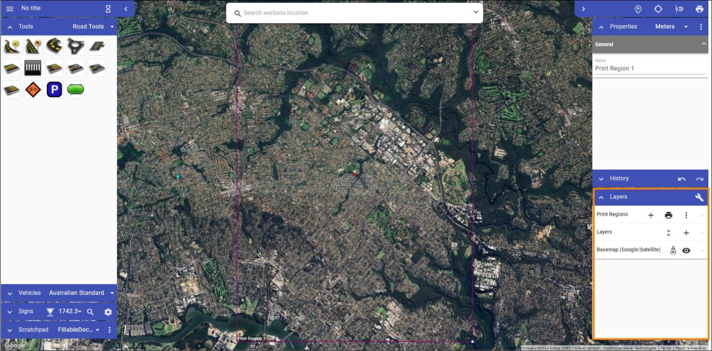

## Print Regions

Print Regions are used to select an area or areas of your plan that will eventually be exported as a pdf or image. In this section of the Layers Palette we are able to create new Print Regions, as well as managing ones and export them as needed.

In the top row of buttons in the Print Regions section of the Layers Pallette:

- **Plus icon**: Create a new Print Region.
- **Printer icon**: Print *all* Print Regions.

There is also the 3 Dots Icon, which opens a drop down menu with the following buttons:

- **Fit All To Page Size**: Fit the Print Region (blue rectangle) to the Page Preview (red rectangle).
- **Turn Off Page Preview**: Shows only the Blue Print Region, removing the external red Page Preview rectangle that matches the selected page size in your [print settings](/rapid-online/9.%20Printing%20and%20Exporting/).
- **Hide Print Regions**: Hide Print Regions so that you can work on design without distraction.
- **Orientation**: Change the orientation of the Page Preview.
- **Page Size**: Change the Page size of your Page Preview.

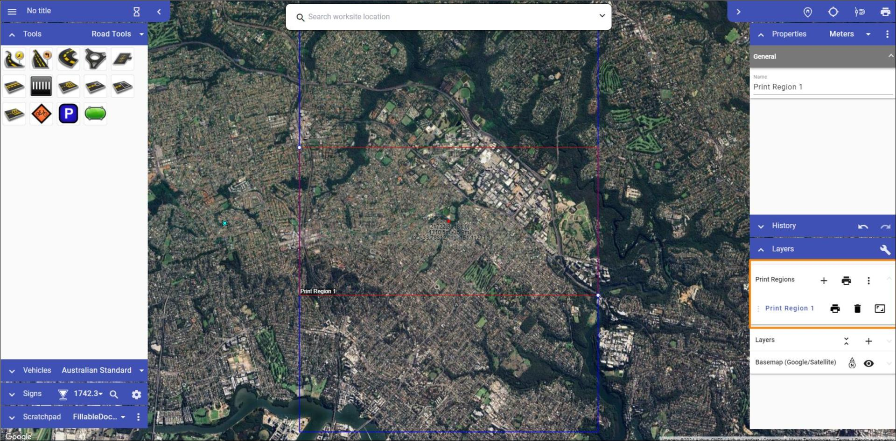

**Options related to specific Print Regions in the Print Regions section of the Layers Pallette:**

| **Function** | **Symbol** | **Details**|
| :------------------ | :----------------- |:---------------|
|Add new layer |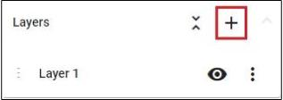 | Creates a new layer, which is then visible in the layers list. |
|Flatten layers |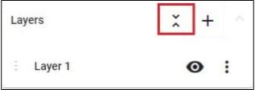 | Brings all of your current layers, and their objects, into a single layer. |
|Move layer |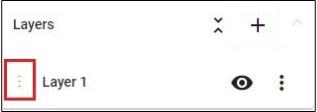 |Dragging this icon allows you to adjust the sequence of the layers in the list. This determines the order in which layers are visible on the plan.  |
|Hide layer  |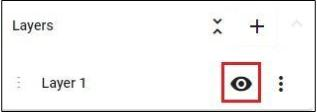 |This icon toggles the visibility of the layer.  |
|Layer settings  |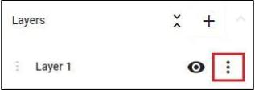 | The 'More Options' icon allows you to rename the layer, adjust its opacity or delete that layer. |

Once you have created a Print Region using the plus icon in the Print Regions sub-menu, it will appear on the plan. Its proportions can be manipulated using its control points, and it can be moved by clicking and dragging the Print Region's name in its bottom left corner.

Note that the red box represents the boundaries of the Print Region, this is content that you require to be in your eventual export. The blue box is the Print Preview, it shows what else will be captured on the final plan page. The blue print Preview Box is based on your chosen page size and orientation, selected in your [Print Options](/rapid-online/9.%20Printing%20and%20Exporting/printing-and-exporting.md).

**Note:** You might choose to populate the space in between the red Print Region and the blue Print Frame with your title box and accompanying annotation.

## Basemap

The Basemap sub-menu allows you to adjust the characteristics of your Basemap.

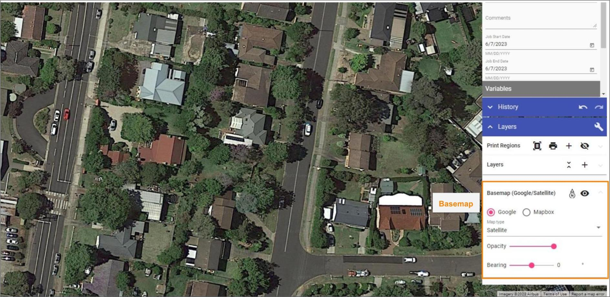

**Elements in "Basemap" section and their functions:**

| **Function** | **Symbol** | **Details**|
| :------------------ | :----------------- |:---------------|
| Bearing arrow  |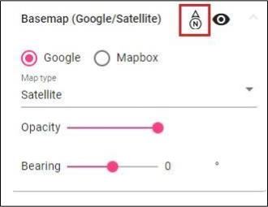  | Shows which direction is north, rotating when you change the bearing.  |
| Basemap visibility toggle  |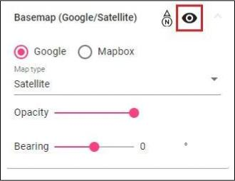  | Turn basemap on and off. |
| Map Provider  |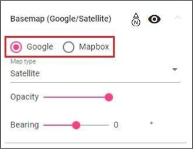  | Change map provider (Google, Mapbox). |
| Map Type  |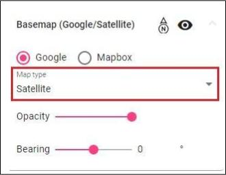  | Change between different map types (road, satellite, hybrid, etc.). |
| Opacity slide bar  |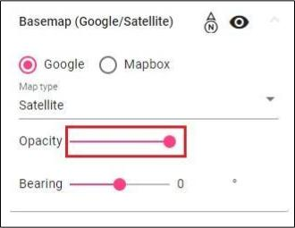  | Change basemap opacity, you can make it a little transparent so the drawn objects stand out more. |
| Bearing slide bar |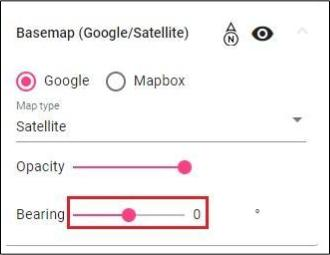  | Alters the bearing of the plan, rotating it. |
