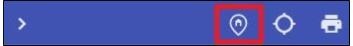
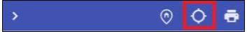
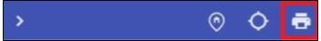

---

sidebar_position: 7

---
# Toolbar

The Toolbar, located in the top right corner of the RapidPlan Online workspace, contains a small number of buttons available for quick access.

| Feature name                 |                Button                 | Description                                                  |
| --------------------- | :-----------------------------------: | ------------------------------------------------------------ |
| **Go to Plan Origin**             |  | Return to the initial location where the plan was started.       |
| **Toggle Geolocation** |  | Once enabled, this button will move the map to your location. |
| **Print**          | | Open the printing dialogue to print or export a plan. |
