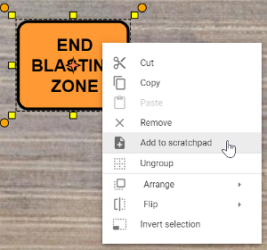

---

sidebar_position: 11

---
# Scratchpad Palette

The Scratchpad is used to store any object that you commonly use or have manually created. This way they are easily accessible and don't need to be created again.

To add an object to your Scratchpad, just select the object in the Canvas Area to bring up the context menu next to it. Then select "Add to Scratchpad" from the menu. The object will then be added to your Scratchpad.

All objects added to your scratchpad are saved to your account, making them available to use on any new plans you create.

## Managing items in your Scratchpad

Items added to the Scratchpad will be placed in the 'Page' (similar to a folder) that is currently open.
Adding labelled Pages to your Scratchpad is valuable to categorise and organise your objects.

Initially your Scratchpad will have one page. If you would like to **add a new Page**: Simply click the 3 dots button in the palette's heading bar, and click "Add New Page".
Note that Pages can also be **Renamed** or **Deleted** your current page from this menu.

The **Page** you currently have open will be the **Page** an item saved to your **Scratchpad** will go into. **Pages** can be *renamed* or *deleted* by clicking the button marked with 3 dots next to that page and clicking **Delete** or **Rename Page**. Individual **Scratchpad** items can be moved to different folders or deleted by right clicking on them and following prompts.
