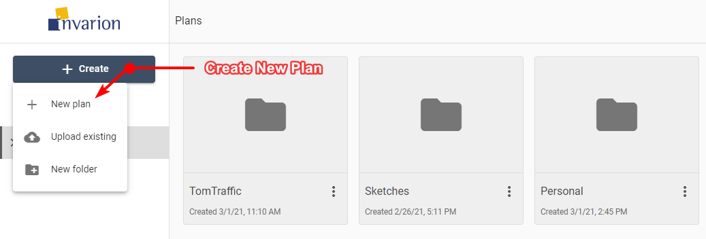

---

sidebar_position: 4

---
# Creating New Plan

To create a new plan simply click on the "Create" button in the navigation menu and choose "New plan" from the menu. The plan will be created in the folder you are currently in, and you will be taken automatically to RapidPlan Online.

