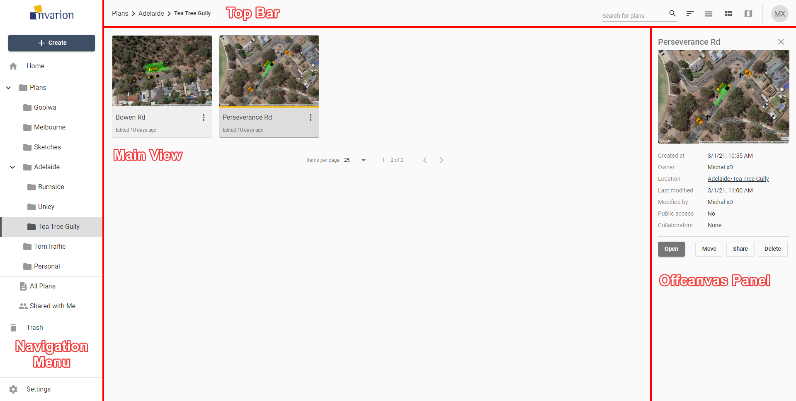

---

sidebar_position: 1

---
# The Invarion Cloud and its Layout

## What is the Invarion Cloud?

Invarion Cloud is an online application for storing all your plans and related documents. It is also the entry point to the RapidPlan Online and other web-based Invarion applications.

**Note:** Invarion Cloud has superseded our old storage application, the RapidPlan Cloud.

## Its Layout

The Invarion Cloud is a dynamic web-application that consists of for main elements:

|Element|Description|
|-----------|-----------|
| [**Navigation Menu**](./navigation-menu.md)      | Navigation menu located on the left side of the screen is used to navigate through different sections of the Invarion Cloud such as "Plans", "Trash", "Shared with Me". Navigation menu also holds "+ Create" button for creating new plans, folders or uploading existing plan from your computer. Click [here](./navigation-menu.md) for more details. |
| **Main View**   | Main view of the page showing the plans within the selected folder or section. Click [here](For information on how to manage the plans in the Main View.|
| [**Off-canvas Panel**](./off-canvas-panel.md) |  Panel on the right side of the screen used for displaying details of selected plan or folder. Click [here](./off-canvas-panel.md) for more details.|
| **Top Bar**   | At the top of the page, on the left side you can find an interactive path to your current location. Right part of the top bar is populated by a search input for searching folders and plans, toggle buttons for switching the type of view and your initials button that holds a link to account settings, support page and logout option.       |

**Note:** Even though Invarion Cloud is a single page application, it stores your current folder location in your web browser search bar. Thanks to that, you can successfully create browser bookmarks for your favourite or commonly used sections.
