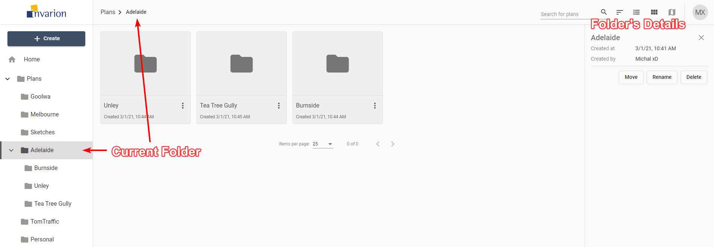

---

sidebar_position: 8

---
# Off-Canvas Panel

Plan's or folder's details can be shown in the hideable panel on the right side of the screen. To see them click on a plan that interests you or open the folder. If you already are inside the folder which the details you want to see, click on the folder's name in the top bar.

|Plan's Details||
|---|---|
|**Created at**|Creation time and date|
|**Owner**|Plan's owner|
|**Location**|Location of the plan in the Invarion Cloud. Clicking on it will take you to the containing folder.|
|**Last modified**|Time and date of the last modification made to the plan.|
|**Modified by**|User responsible for the last modification. This is especially useful when collaborating with others.|
|**Public access**|Shows whether the plan has enabled sharing via public link.|
|**Collaborators**|List of the other collaborators invited to the plan.|

|Folder's Details||
|---|---|
|**Created at**|Creation time and date|
|**Created by**|Folder's owner|

Additionally, the Off-Canvas panel includes buttons for basic option such as **Open**, **Move**, **Share**, **Delete** for plans, and  **Move**, **Rename**, **Delete** for folders.

**Tip:** Click on plan's or folder's name to rename this plan or folder.
