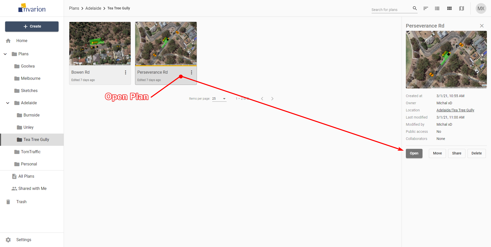

---

sidebar_position: 5

---
# Opening Plans

To open the plan click on it. This will open the panel with plan's details. Look for it on the right side of the screen. Inside the panel click on the "Open" button to open the plan in RapidPlan Online.

**Tip:** To open the plan in a separate tab or window, right click on "Open" and choose the desired option from the context menu.

**Note:** Depending on the current view () plans can be represented by a rows in a table, tiles or pins on the map.
