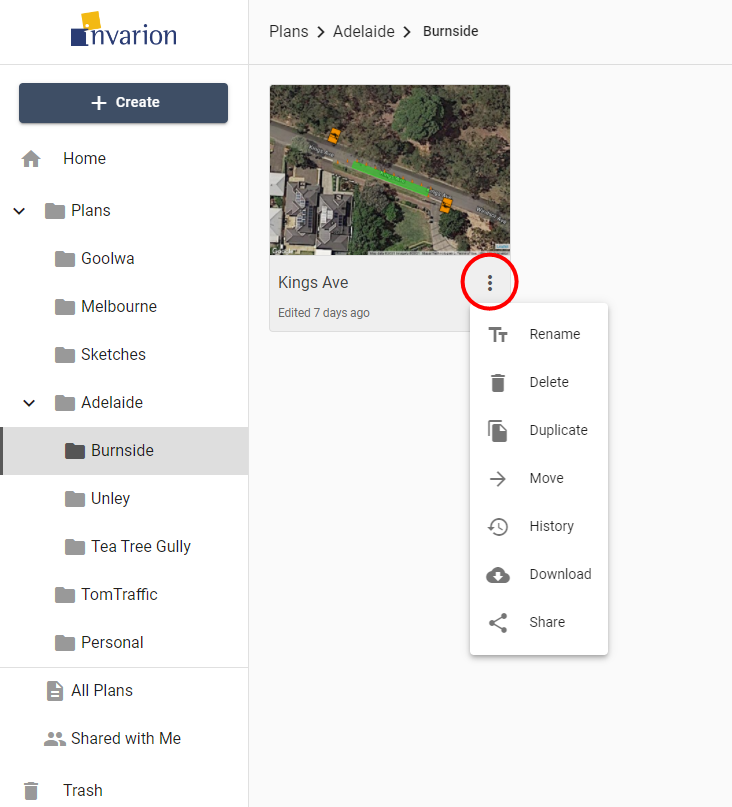

---

sidebar_position: 7

---
# Plans Actions

You can see available actions for the plan by clicking on the "three dots" button near its name. This will open plan's context menu with all options listed.

Different actions you can do on plans:

|Action|Description|
|---|---|
|**Rename**|Rename plan.|
|**Delete**|Move plan to trash.|
|**Duplicate**|Create a copy of the plan. Duplicate will appear in the same location as the original plan.|
|**Move**|Move plan to a different location.|
|**History**|Restore the previous version of the plan. Read more in chapter [Plan's History](./plans-history.md)|
|**Download**|Download plan to your device.|
|**Share**|Opens window with sharing options for the plan. Read more in chapter [Sharing Plans](./sharing-plans.md)  |
