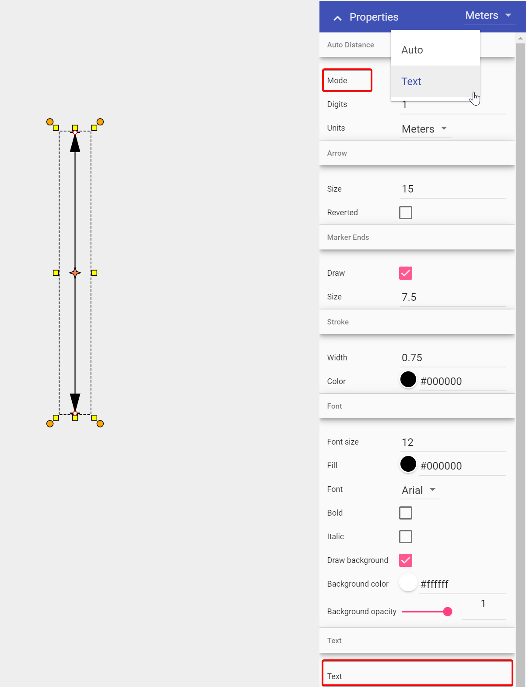

---

sidebar_position: 5

---
# Editing the Distance on the Marker

If you wish to define your own distance on the marker, simply follow the steps below.

- Select the Marker;
- Navigate to the Properties palette;
- Change mode from Auto to Text, enter desired Distance in Text heading;
- Click anywhere on your plan to finish.

